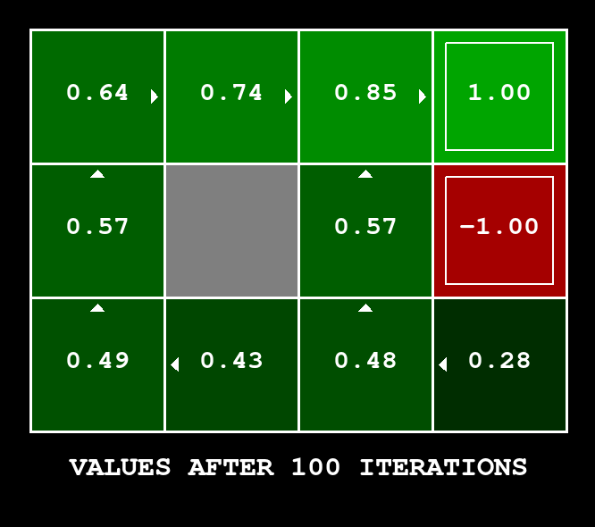
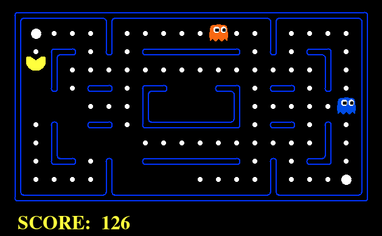

# Value Iteration & Q-Learning
Reinforcement learning project for COMP2050 - Artificial Intelligence course @ VinUniversity.
 
---

## Description

In this project, we implemented 2 main agents:
- **Value Iteration Agent** for solving MDP in a fully observable stochasic environment of GridWorld game
- **Q-Learning Agent** for solving GridWorld, Crawler, and Pacman game.

The project use the supporting material from the UC Berkeley's [CS188 course](https://inst.eecs.berkeley.edu/~cs188/fa18/project3.html)

## Team members

- Pham Quoc Trung - https://github.com/thesunsavior
- Nguyen Dai Nghia - https://github.com/nghia-nd
    - Solutions for Q8 to Q10
    - Implementation for Approximate Q-Learning Agents
    - Solution testing (Q1-Q10), documentation, and code refinement
- Nguyen Tiet Nguyen Khoi - https://github.com/khointn

## Answers
All the implementation and analysis is contained within 3 main files: `valueIterationAgents.py`, `qLearningAgents.py`, and `analysis.py`
#### **Q1. Value iteration**
Specifications: [Project 3: Question 1](https://inst.eecs.berkeley.edu/~cs188/fa18/project3.html#Q1)
- File: `ValueIterationAgent.py`. Class: `ValueIterationAgent`
- Implemented: `runValueIteration()`, `computeQValueFromValues()`, `computeActionFromValues()`.

Autograder: 
```python
python autograder.py -q q1
```

To run the game in manual mode (default behavior is that the agent moves in chosen direction 80% of the time) 
```python
python gridworld.py -m
``` 

To run the game using with policy computed after 100 iterations
```python
python gridworld.py -a value -i 100
```


#### **Q2. Bridge Corssing Analysis**
Specifications: [Project 3: Question 2](https://inst.eecs.berkeley.edu/~cs188/fa18/project3.html#Q2)

Autograder: 
```python
python autograder.py -q q2
```

To run `BridgeGrid` with `discount = 0.2` and `noise = 0.2` (% that agent will not move in chosen direction)
```python
python gridworld.py -a value -i 100 -g BridgeGrid --discount 0.9 --noise 0.2
```


**Answer**: Setting `noise=0` will make the agent cross the bridge since there is no uncertainty of falling into the edges.

#### **Q3. Policies**
Specifications: [Project 3: Question 3](https://inst.eecs.berkeley.edu/~cs188/fa18/project3.html#3)

Autograder: 
```python
python autograder.py -q q3
```

To run `DiscountGrid` with `discount = 0.2`, `noise = 0.0`, and `living reward = -1`
```python
python gridworld.py -a value -i 100 -g DiscountGrid --discount 0.2 --noise 0 --livingReward -1
```

**Answer:**
- a) Prefer the close exit (+1), risking the cliff (-10)
```python
    # Strategy: low discount, no noise, survival penalty
    # => the further the reward, the less attractive
    # => no randomness, no chance falling into the cliff
    # => being alive for long (avoiding the cliff) is not advantageous
    answerDiscount = 0.2
    answerNoise = 0.0
    answerLivingReward = -1
```
- b) Prefer the close exit (+1), but avoiding the cliff (-10)
```python
    # Strategy: low discount, some noise, small survival reward
    # => the further the reward, the less attractive
    # => some randomness, chance falling into the cliff, hence avoid
    # => being alive is advantageous, but not too much
    answerDiscount = 0.2
    answerNoise = 0.2
    answerLivingReward = 0.5
```
- c) Prefer the distant exit (+10), risking the cliff (-10)
```python
    # Strategy: high discount, no noise, survival penalty
    # => further reward are still attractive
    # => no randomness, no chance falling into the cliff
    # => being alive for long (avoiding the cliff) is not advantageous
    answerDiscount = 0.9
    answerNoise = 0.0
    answerLivingReward = -1
```
- d) Prefer the distant exit (+10), avoiding the cliff (-10)
```python
    # Strategy: high discount, noise, survival reward
    # => further reward are still attractive
    # => randomness, chance falling into the cliff, hence avoid
    # => being alive for long is advantageous
    answerDiscount = 0.8
    answerNoise = 0.4
    answerLivingReward = 1
```
- e) Avoid both exits and the cliff (so an episode should never terminate)
```python
    # Strategy: no discount, noise, survival reward
    # => reward are not attractive
    # => full randomness
    # => being alive for long is advantageous
    answerDiscount = 0
    answerNoise = 1
    answerLivingReward = 1
```

#### **Q4. Asynchronous Value Iteration**
Specifications: [Project 3: Question 4](https://inst.eecs.berkeley.edu/~cs188/fa18/project3.html#4)

- File: `ValueIterationAgent.py`. Class: `AsynchronousValueIterationAgent`
- Implemented: `runValueIteration()`

Autograder: 
```python
python autograder.py -q q4
```

To run the `AsynchronousValueIterationAgent` with 1000 iterations
```python
python gridworld.py -a asynchvalue -i 1000
```

#### **Q5. Prioritized Sweeping Value Iteration**
Specifications: [Project 3: Question 5](https://inst.eecs.berkeley.edu/~cs188/fa18/project3.html#5)

- File: `ValueIterationAgent.py`. Class: `PrioritizedSweepingValueIterationAgent`
- Implemented: `runValueIteration()`

Autograder: 
```python
python autograder.py -q q5
```

To run the `PrioritizedSweepingValueIterationAgent` with 1000 iterations
```python
python gridworld.py -a priosweepvalue -i 1000
```

#### **Q6. Q-Learning**
Specifications: [Project 3: Question 6](https://inst.eecs.berkeley.edu/~cs188/fa18/project3.html#6)

- File: `qLearningAgents.py`. Class: `QLearningAgent`
- Implemented: `getQValue()`, `computeValueFromQValues()`, `computeActionFromQValues()`, `update()`

Autograder: 
```python
python autograder.py -q q6
```

To observe Q-Learning under manual control using keyboard
```python
python gridworld.py -a q -k 5 -m
```

#### **Q7. Epsilon Greedy**
Specifications: [Project 3: Question 7](https://inst.eecs.berkeley.edu/~cs188/fa18/project3.html#7)

- File: `qLearningAgents.py`. Class: `QLearningAgent`
- Implemented: `getAction()`

Autograder: 
```python
python autograder.py -q q7
```

To observe Q-Learning with `epsilon = 0.3`
```python
python gridworld.py -a q -k 100 --noise 0.0 -e 0.3
```

**Crawler**: to run the Crawler bot using Q-Learning agent. The parameter can be customized in the GUI
```python
python crawler.py
```


#### **Q8. Bridge Crossing Revisited**
Specifications: [Project 3: Question 8](https://inst.eecs.berkeley.edu/~cs188/fa18/project3.html#8)

Autograder: 
```python
python autograder.py -q q8
```

To run `BridgeGrid` for 50 episodes and observe whether the agent find optimal policy 
```python
python gridworld.py -a q -k 50 -n 0 -g BridgeGrid -e 1
```

**Answer:** Despite parameter tuning, it is *impossible* to learn the optimal policy given a limited learning episodes. This is a caveat of Q-Learning since it requires lots of learning to achieve desirable performance.

#### **Q9. Q-Learning and Pacmam**
Specifications: [Project 3: Question 9](https://inst.eecs.berkeley.edu/~cs188/fa18/project3.html#9)

Autograder: 
```python
python autograder.py -q q9
```

To run Pacman with 2000 episodes of traning on `SmallGrid`
```python
python pacman.py -p PacmanQAgent -x 2000 -n 2010 -l smallGrid 
```

However, this configuration of Pacman does not work well on `MediumGrid` since it lacks the capability to generalize the state similarity.

#### **Q10. Approximate Q-Learning**
Specifications: [Project 3: Question 10](https://inst.eecs.berkeley.edu/~cs188/fa18/project3.html#10)

- File: `qLearningAgents.py`. Class: `ApproximateQAgent`
- Implemented: `getQValue()` and `update()`

Autograder: 
```python
python autograder.py -q q10
```

To run Pacman with 50 episodes of traning on `mediumGrid`
```python
python pacman.py -p ApproximateQAgent -a extractor=SimpleExtractor -x 50 -n 60 -l mediumGrid 
```
The performance is quite remarkable on `mediumGrid` and `mediumClassic` with only 50 episodes to achieve high rate of winning. 




However, `ApproximateQAgent` have minor troubles on the `smallGrid` due to the dead-end setup for 50 episodes of training.

